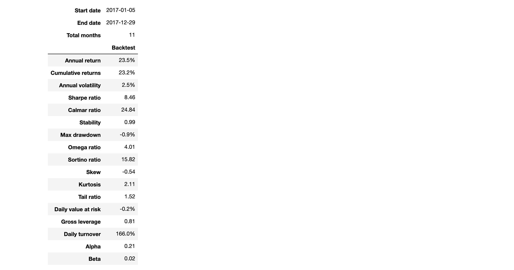

##Portfolio optimization subject to leverage, position concentration, transaction cost and sector exposure constraints

For example, the optimal_non_reducing_dollar_neutral_weights() method minimizes net dollar exposure subject to position concentration bounds and leverage constraints. It does so only by adding new positions and not reducing existing position. The rationale for this is reducing transaction costs.

Below is a backtest including transaction costs using this portfolio construction model. Net exposure is close to zero as desired. Beta to SPY and risk factor betas are close to zero as well.

